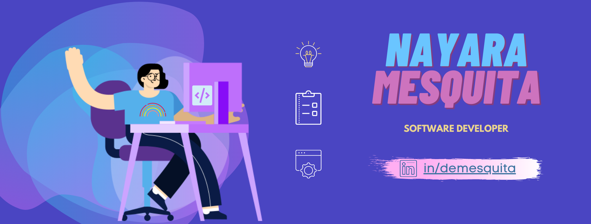

### Hi there </h2>

😄 Pronouns: She/Her

<table>
    <tr>
         
        
    </tr>   
</table>

 

<a href="https://www.linkedin.com/in/demesquita"></img></a> [LinkedIn](https://www.linkedin.com/in/demesquita)
<!--
**DeMesquita/DeMesquita** is a ✨ _special_ ✨ repository because its `README.md` (this file) appears on your GitHub profile.

Here are some ideas to get you started:

- 🔭 I’m currently working on ...
- 🌱 I’m currently learning ...
- 👯 I’m looking to collaborate on ...
- 🤔 I’m looking for help with ...
- 💬 Ask me about ...
- 📫 How to reach me: ...
- 😄 Pronouns: ...
- ⚡ Fun fact: ...
-->
